# Machine Learning
Machine Learning is an advanced data science topic that I have struggled over whether to include in this text.  On the one hand, it is not generally considered part of classical statistics.  In addition, unless your plans include becoming a data analyst, you are unlikely to run these analyses on your own.  On the other hand, machine learning is playing an increasing role in agricultural (and all areas of) data.  It is a topic in which I have been immersed during the past couple of years.  

Most importantly, if you are using tools to select hybrids, adjust nitrogen rates, or predict yield, those tools likely incorporate aspects of machine learning.  In your daily lives, machine learning determines what advertisements you see, your social media feed, even the results from your search engines.   This lesson emphasizes literacy about machine learning -- there are no coding exercises included. 

## Machine Learning
To start with, why is it called "machine learning"?  It sounds like statistics-meets-steampunk. To answer this, think about a machine that learns.  In other words: a robot.  In machine learning, we use complex algoritms that, in theory, could be used by artificial intelligence to learn about their environment.  There is a strong predictive component to this: the machine could learn to predict the outcomes of future events by building models based on data it has already obtained.  Hello, Skynet.

This sword, however, is also a plowshare.  Machine learning can help us understand how many variables can simultaneously predict outcomes, in agriculture, medicine, and climate.  Furthermore, machine learning takes a different approach to models than the methods we have learned earlier.  In previous units, we have learned testing methods that were *parameteric*.  We defined a linear model, then used our tests (which were all variations of regression) to parameterize it.  Parameteric => parameter.

We've also learned that parametric methods have their challenges.  One challenge is non-normal or skewed data.  Another is heterogeneity of variances.  These challenges required us to transform the data, a step which can generate confusion in analyzing and summarizing data.  We were also warned when working with multiple linear regression models to beware of multicollinearity (correlations between independent variables) and heteroscedasticity (unequal variances).  

Machine learning uses *nonparametric* tests.  As the name suggests, these do not use parameters.  Instead of regression models, machine learning tools use logical tests (for example, does an observed value fall in a range) to "decide" what value to predict.  They measure the "similarity" between two locations to decide whether an observation in one location is likely to occur in the other.  They figure out how to group similar observations into groups or "clusters".

In this unit, we will study three examples of machine learning.  First, we will see how cluster analysis might be used to divide a sales territory into multiple regions, based on environment. Second, we will learn how to use *nearest-neighbor* analysis to predict yield for a given county, given its similarity to other counties.  Finally, we will learn how *classification trees* can be used to explain yield response to multiple enviornmental factors.

This unit will be more focused on what I call "data literacy" than execution.  I want you to be aware of these three tools, which are being used around you in the agronomy world.  I want you to be able to speak of them, to ask questions, if engaged.  I will resist going deep into the weeds with them, however, because they are often best suited to hundreds (ok) or many thousands (even better) of data points.  It is unlikely you will use them in your Creative Component, or even your day-to-day research.

That said, just a few years ago, neither did I.  Awareness and curiosity in data science are always good -- there is always a more powerful way to address our questions.


## Cluster Analyses 
Cluster analysis takes a set of individuals (sometimes called examples in this analyses) and divides it into a set number of groups, based on the similarities between the individuals.  These groups are defined such that the individuals within a group are very similar to each other, but very different from individuals in other groups.  

By itself, clustering doesn't answer any questions about the values of the individuals in our data set.  Unlike a classification tree or a k-Nearest Neighbor analysis, it cannot be used to interpolate values between data points, or predict the value of a future observation.

To further illustrate cluster analysis, it is described in the data science community as "unsupervised learning." This means that we do not begin with a variable of interest, nor a hypothesis about how changes in one variable relate to changes in another.  

Why would we want to cluster data?  The reason is that sometimes, when we are dealing with many variables, our analyses may become more intuitive if there are ways to break data down into groups.  Clustering is a way of reducing or categorizing our data so it becomes less-overwhelming for us to deal with.

### Case Study: Grouping Midwestern Environments
For example, anytime we are working with environmental data, we have potentially enormous datasets.  Rather than try juggle the meanings of all these quantitative variables in our heads, we may want to desrcibe the data as a series of groups.  For example, we might say that a county in South Dakota is cold and dry, a county in northern Illinois is moderate temperature and moderate wetness, and a farm in western Ohio is warm and rainy.  Great, we now have three groups.  But how would other counties in the midwest sort into these three categories?

For an agronomic testing program, this is a very important question.  If the intent is to address the individual needs of three different environments, we need to define those regions so that a sufficient, but not excessive, number of research locations can be designated within each environment.

Lets start out with dataset of county environments.  The county environments are mostly soil data, which are not expected to change (outside of human influence) in the short term.  Two data are climatic: growing degree days (gdd) and precipitation (ppt). Their values in this dataset reflect a 20-year mean.

Below I have plotted the mean annual precipitation (in millimeters).  We see that precipitation is lowest in the Dakotas and generally increases as we move south and east.


```r
library(readr)
library(tidyverse)
```

```
## -- Attaching packages --------------------------------------- tidyverse 1.3.1 --
```

```
## v ggplot2 3.3.5     v dplyr   1.0.8
## v tibble  3.1.6     v stringr 1.4.0
## v tidyr   1.2.0     v forcats 0.5.1
## v purrr   0.3.4
```

```
## Warning: package 'ggplot2' was built under R version 4.1.3
```

```
## -- Conflicts ------------------------------------------ tidyverse_conflicts() --
## x dplyr::filter() masks stats::filter()
## x dplyr::lag()    masks stats::lag()
```

```r
library(sf)
```

```
## Linking to GEOS 3.9.1, GDAL 3.2.1, PROJ 7.2.1; sf_use_s2() is TRUE
```

```r
library(leaflet)
library(RColorBrewer)
```

```
## Warning: package 'RColorBrewer' was built under R version 4.1.3
```

```r
library(htmlwidgets)
library(webshot2)


clean_data_w_geo <- st_read("data-unit-13/midwest_county_data.shp", quiet=TRUE) 


pal_ppt = colorBin("RdYlGn", bins=5, clean_data_w_geo$ppt)

m <- clean_data_w_geo %>%
  leaflet() %>%
  addTiles() %>%
  addPolygons(
    fillColor = ~pal_ppt(ppt),
    fillOpacity = 0.8,
    weight=1,
    color = "black"
  ) %>%
  addLegend(pal = pal_ppt,
            values = ~ppt
  )

#above code won't knit -- created static image for markdown
saveWidget(m, "temp.html", selfcontained = FALSE)
webshot("temp.html", cliprect = "viewport")
```

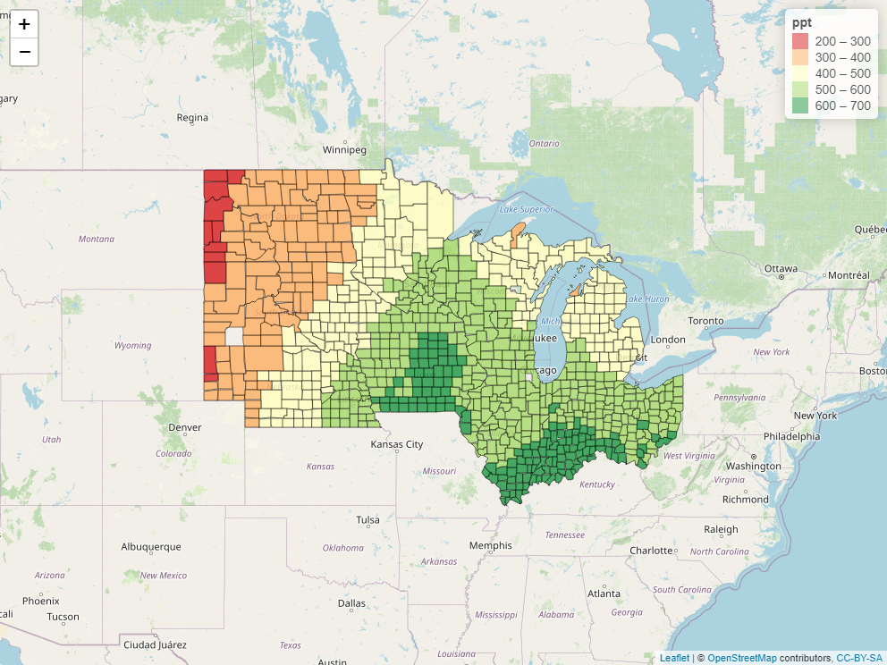<!-- --> 

Next up, here is a plot of percentage sand. This is a fascinating map.  We can see the path of the glaciers down through Iowa and the Des Moines lobe.  Areas with low sand (red below) are largely below the southern reach of the glacier.  These areas tend to be high in silt.  Conversely, we can see the outwash areas (green below) of the Nebraska Sand Hills, central Minnesota, northern Wisconsin, and Western Michigan, where rapid glacial melting sorted parent material, leaving them higher in sand and rock fragments.


```r
pal_sand = colorBin("RdYlGn", bins = 5, clean_data_w_geo$sand)

m <- clean_data_w_geo %>%
  leaflet() %>%
  addTiles() %>%
  addPolygons(
    fillColor = ~pal_sand(sand),
    fillOpacity = 0.8,
    weight=1,
    color = "black"
  ) %>%
  addLegend(pal = pal_sand,
            values = ~sand
  )

#above code won't knit -- created static image for markdown
saveWidget(m, "temp.html", selfcontained = FALSE)
webshot("temp.html", cliprect = "viewport")
```

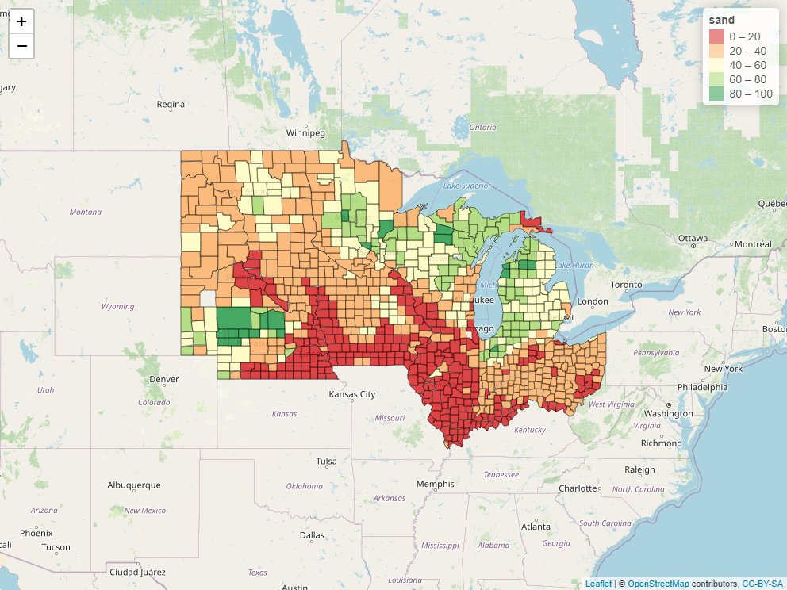<!-- --> 

We can continue looking at different variables, and through that process might arrive at a general conclusions.  Counties that are further south or east tend to receive greater precipitation and more growing degree days (GDD). Counties that are further north and east tend to have more sand and less silt or clay in their soils.

But where do these boundaries end?  Say you have a product, like pyraclostrobin, that may reduce heat, and you want to test it across a range of environments that differ in temperature, precipitation and soil courseness.  How would you sort your counties into three groups?  This is where cluster analysis becomes very handy.  

### Scaling
When we conduct a cluster analysis, we must remember to scale the data first.  Clustering works by evaluating the distance between points.  The distance between points $p$ and $q$ is calculated as:

$$dist(p,q) = \sqrt{(p_1 - q_1)^2 + (p_2 - q_2)^2 ... (p_n - q_n)^2} $$

Remember, this distance is Euclidean -- it is the same concept by which we calculate the hypotenuse of a triangle, only in this case we are working with a many more dimensions.  Euclidean distance is commonly described when we refer to "as the crow flies" -- it is the shortest distance between two points.  

Cluster analysis will work to minimise the overall distance.  If one variable has a much wider range of values than another, it will be weighted more heavily by the clustering algorithm.  For example, in our dataset above, growing degree days range from 1351 to 4441, a difference of almost 3100.  Precipitation, on the other hand, only ranges from 253 to 694, a different of 341.  Yet we would agree the that growing degree days and precipitation are equally important to growing corn!  

The solution is to *scale* the data so that each variable has a comparable range of values. Below are the cumulative growing degree days, precipitation, and percent clay values for the first 10 counties in our dataset.  You can see how they differ in the range of their values.  


```r
cluster_vars_only = clean_data_w_geo %>%
  dplyr::select(whc, sand, silt, clay, om, ppt, cum_gdd) %>%
  na.omit()

cluster_vars_only %>%
  filter(row_number() <= 10) %>%
  dplyr::select(cum_gdd, ppt, clay) %>%
  kableExtra::kbl()
```

```
## Registered S3 method overwritten by 'webshot':
##   method        from    
##   print.webshot webshot2
```


\begin{tabular}[t]{r|r|r|l}
\hline
cum\_gdd & ppt & clay & geometry\\
\hline
3140.368 & 598.4478 & 33.73933 & MULTIPOLYGON (((-94.70063 4...\\
\hline
3145.911 & 609.1156 & 34.32862 & MULTIPOLYGON (((-94.92759 4...\\
\hline
2633.780 & 599.4642 & 28.56537 & MULTIPOLYGON (((-91.61083 4...\\
\hline
3241.873 & 659.3385 & 37.16523 & MULTIPOLYGON (((-93.09759 4...\\
\hline
2989.952 & 598.6462 & 30.46776 & MULTIPOLYGON (((-95.09286 4...\\
\hline
2869.339 & 606.5850 & 26.67489 & MULTIPOLYGON (((-92.29879 4...\\
\hline
2796.425 & 612.5765 & 21.99091 & MULTIPOLYGON (((-92.55449 4...\\
\hline
2971.723 & 611.0333 & 21.81959 & MULTIPOLYGON (((-94.1647 42...\\
\hline
2727.186 & 618.2398 & 21.67287 & MULTIPOLYGON (((-92.55421 4...\\
\hline
2683.756 & 620.8813 & 21.66446 & MULTIPOLYGON (((-92.08166 4...\\
\hline
\end{tabular}
Here are those same 10 counties, with their values for cum_gdd, ppt, and clay scaled.  One of the easiest ways to scale the data are to convert their original values to Z-scores, based on their normal distributions.  We do this exactly the way we calculated Z-scores in Unit 2.

We can see, for each variable, values fall mainly between -1 and 1.

```r
cluster_ready_data = cluster_vars_only %>%
  st_drop_geometry() %>%
  as.data.frame() %>%
  scale()

cluster_ready_data %>%
  as.data.frame() %>%
  filter(row_number() <= 10) %>%
  dplyr::select(cum_gdd, ppt, clay)
```

```
##        cum_gdd       ppt       clay
## 1   0.55154310 0.8572820  1.1905194
## 2   0.56106037 0.9708866  1.2651893
## 3  -0.31828780 0.8681063  0.5349214
## 4   0.72583066 1.5057241  1.6246202
## 5   0.29327347 0.8593956  0.7759755
## 6   0.08617543 0.9439380  0.2953761
## 7  -0.03902028 1.0077425 -0.2981361
## 8   0.26197313 0.9913093 -0.3198444
## 9  -0.15790581 1.0680532 -0.3384352
## 10 -0.23247627 1.0961831 -0.3395009
```

### Clustering Animation

```r
library(animation)
km_animation_data = cluster_ready_data %>%
  as.data.frame() %>%
  sample_n(45) %>%
  dplyr::select(cum_gdd, silt) %>%
  as.matrix()
```


Using two variable, cum_gdd and silt and the animation below, lets walk through how clustering works.  

In the plot above, cum_gdd is on the X-axis and silt is on the Y-axis.  We want to cluster (or divide) our points inth three groups.  Colors have been assigned randomly to the points (smaller circles).  They are scattered instead of being grouped by proximity to each other. After clustering, the points will be colored according to group.

The first step is to randomly place three *centroids* in our plot.  These are indicated by the large circles.


2) Next, for each point, we classify each point by its nearest centroid.  In the plot below, this is represented by each point taking the same color as its nearest centroid.    

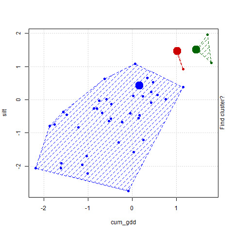

3) But now our centroid is not in the center of the group.  So we will move it to the center of the group, as seen in the plot below.

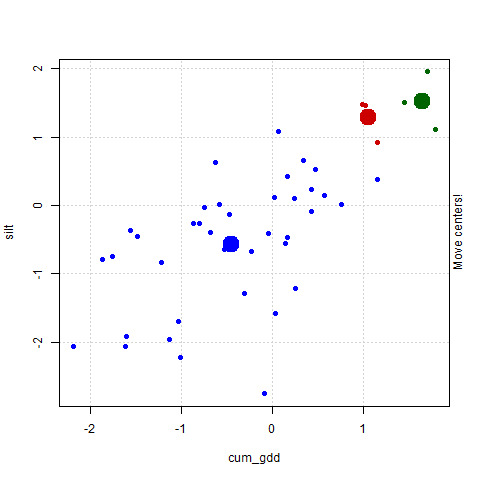

As soon as we move the centroids to the middle of its group, however, a problem occurs.  Remember, each point is identifed by the nearest centroid.  So the groupings of the points again changes.  In particular, the number of points in the red grouping increases.

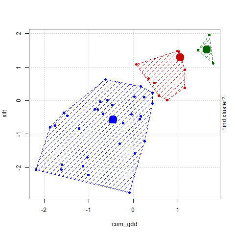

We move our centroids again.  You will notice both the red and blue centroids have moved down and to the left.

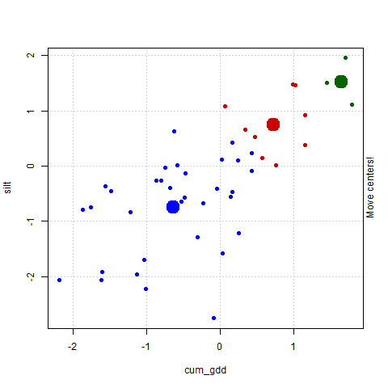

We reclassify the points.  The number of red points has again increased.

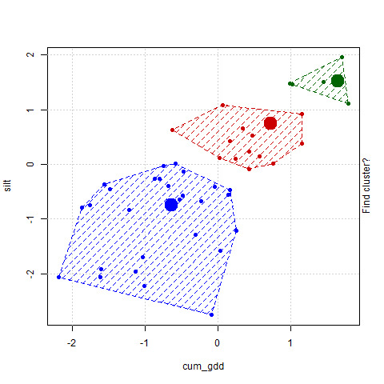

This process repeats over and over again until, eventually, there is no more movement in the centroids.  At this point, the cluster analysis is said to have converged on its final groupings.  The positions of the centroids are typically used to define the new groupings.  


```r
set.seed(112020)
kmean_silt_gdd = kmeans(km_animation_data, 3)

kmean_silt_gdd$centers %>%
  as.data.frame() %>%
  rownames_to_column("cluster") %>%
  kableExtra::kbl()
```


\begin{tabular}[t]{l|r|r}
\hline
cluster & cum\_gdd & silt\\
\hline
1 & -1.3045471 & -1.1556767\\
\hline
2 & -0.2557197 & 0.2991182\\
\hline
3 & 1.0860757 & 0.9984785\\
\hline
\end{tabular}
The table above contains the final center estimates from the cluster algorithm.  Cluster 1 is warmer and has siltier soil.  Cluster 2 has medium numbers of growing degree days and silt.  Cluster 3 is cooler and has soils lower in clay.

### County Cluster Analysis
Now, let's run the cluster analysis with all of our variables.  The cluster enters within each variable are shown below.


```r
# cluster identification
clusters = kmeans(cluster_ready_data, 3)

clusters$centers %>%
  kableExtra::kbl() 
```


\begin{tabular}[t]{r|r|r|r|r|r|r}
\hline
whc & sand & silt & clay & om & ppt & cum\_gdd\\
\hline
-0.0152348 & 0.1147455 & -0.3219194 & 0.2808926 & 0.1693996 & -0.7947552 & -0.6478638\\
\hline
0.4188589 & -0.7234396 & 0.7811347 & 0.4051389 & -0.4065930 & 0.7064892 & 0.7585691\\
\hline
-1.0435272 & 1.6497023 & -1.4394576 & -1.5196343 & 0.7460924 & -0.4326339 & -0.8192046\\
\hline
\end{tabular}


```r
# classify centers and rejoin with original data
centers = as.data.frame(clusters$centers) %>%
  rownames_to_column("cluster") %>%
  gather(attribute, value, -cluster) %>%
  mutate(named_value = case_when(value < -0.45 ~ "low",
                                 value > 0.45 ~ "high",
                                 value >= -0.45 & value <=0.45 ~ "ave")) %>%
  dplyr::select(-value) %>%
  spread(attribute, named_value) %>%
  mutate(cluster = as.numeric(cluster)) %>%
  rename(om_class = om,
         ppt_class = ppt,
         clay_class = clay,
         silt_class = silt,
         sand_class = sand,
         whc_class = whc,
         gdd_class = cum_gdd)
    
cluster_df <- clusters$cluster %>%
  enframe(name=NULL, value="cluster")

classified_data <-  cluster_ready_data %>%
  cbind(cluster_df) %>%
  left_join(centers, by="cluster") 

centers %>%
  kableExtra::kbl()
```


\begin{tabular}[t]{r|l|l|l|l|l|l|l}
\hline
cluster & clay\_class & gdd\_class & om\_class & ppt\_class & sand\_class & silt\_class & whc\_class\\
\hline
1 & ave & low & ave & low & ave & ave & ave\\
\hline
2 & ave & high & ave & high & low & high & ave\\
\hline
3 & low & low & high & ave & high & low & low\\
\hline
\end{tabular}
We can now plot our clusters on a map.  Cluster 1, which has a greater growing degree days, precipitation and silt, accounts for much of the lower third of our map.  Cluster 2, which has lower growing degree days and precipitation, accounts for most of northwestern quarter of counties.  Cluster 3, which is most remarkable for its higher sand content, accounts for parts of Nebraska, central Wisconsin and counties to the south and east of Lake Michigan.
  

```r
classified_data_w_geo = clean_data_w_geo %>%
  dplyr::select(stco, geometry) %>%
  cbind(classified_data) %>%
  st_as_sf()
classified_data_w_geo = st_transform(classified_data_w_geo, 4326)

pal_ppt = colorFactor("RdYlGn", classified_data_w_geo$cluster)

m <- classified_data_w_geo %>%
  leaflet() %>%
  addTiles() %>%
  addPolygons(
    fillColor = ~pal_ppt(cluster),
    fillOpacity = 0.8,
    weight=1,
    color = "black",
    popup = paste0("om: ", classified_data_w_geo$om_class, "<br>",
                   "ppt: ", classified_data_w_geo$ppt_class, "<br>",
                   "clay: ", classified_data_w_geo$clay_class, "<br>", 
                   "silt: ", classified_data_w_geo$silt_class, "<br>",
                   "sand: ", classified_data_w_geo$sand_class, "<br>",
                   "whc: ", classified_data_w_geo$whc_class, "<br>",
                   "gdd: ", classified_data_w_geo$gdd_class)
  ) %>%
  addLegend(pal = pal_ppt,
            values = ~cluster
  )

#above code won't knit -- created static image for markdown
saveWidget(m, "temp.html", selfcontained = FALSE)
webshot("temp.html", cliprect = "viewport")
```

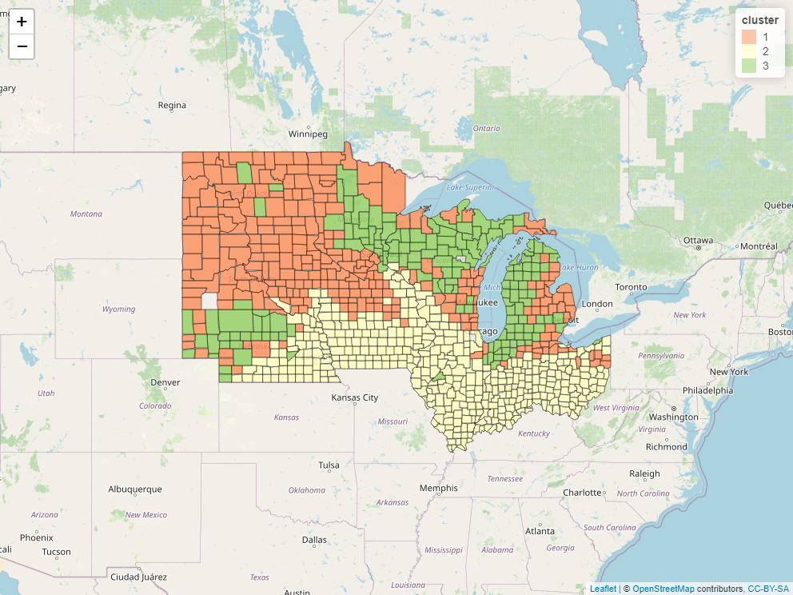<!-- --> 


## k-Nearest-Neighbors
In *k-Nearest-Neighbors* (kNN) analyses, we again use the Euclidian distance between points.  This time, however, we are not trying to cluster points, but to guess the value of a variable one observation, based on how similar it is to other observations.  

### Case Study: Guessing County Yields based on Environmental Similarity
For this example, we will continue to work with our county environmental dataset.  This dataset includes yields for corn, soybean, and, where applicable, wheat and cotton.  What if, however, our corn yield data were incomplete: that is, not every county had a recorded yield for corn.  How might we go about guessing/estimating/predicting what that corn yield might be?

Well, if you are a farmer and you are interested in a new product -- what might you do?  You might ask around (at least the farmers who aren't bidding against you for rented land) and see whether any of them have used the product and what response they observed.  

In considering their results, however, you might incorporate additional information, namely: how similar are their farming practices to yours?  Are they using the same amount of nitrogen fertilizer?  Do they apply it using the same practices (preplant vs split) as you?  Are they planting the same hybrid?  What is their crop rotation?  What is their tillage system?

In other words, as you ask around about others experiences with that product, you are also, at least intuitively, going to weigh their experiences based on how similar their practices are to yours.  (Come to think of it, this would be great dataset to mock up for a future semester!)

In other words, you would predict your success based on your nearest neighbors, either by physical distance to your farm, or by the similarity (closeness) of your production practices.  If that makes sense, you now understand the concept of nearest neighbors.

For our county data scenario, we will simulate a situation where 20% of our counties are, at random, missing a measure for corn yield.


```r
yield_and_env = clean_data_w_geo
```


```r
library(caret)
```

```
## Loading required package: lattice
```

```
## 
## Attaching package: 'caret'
```

```
## The following object is masked from 'package:purrr':
## 
##     lift
```

```r
set.seed(112120)
trainingRows = createDataPartition(yield_and_env$corn, p=0.80, list = FALSE)
trainPartition = yield_and_env[trainingRows,]
trainData = trainPartition %>%
  st_drop_geometry() %>%
  dplyr::select(-stco)
testData = yield_and_env[-trainingRows,] 
```


```r
trainPartition = st_transform(trainPartition, 4326)

pal_corn = colorBin("RdYlGn", bins=5, trainPartition$corn)

m <- trainPartition %>%
  leaflet() %>%
  addTiles() %>%
  addPolygons(
    fillColor = ~pal_corn(corn),
    fillOpacity = 0.8,
    weight=1,
    color = "black",
    popup = paste("yield:", as.character(round(trainPartition$corn,1)))
  ) %>%
  addLegend(pal = pal_corn,
            values = ~ppt
  )

#above code won't knit -- created static image for markdown
saveWidget(m, "temp.html", selfcontained = FALSE)
webshot("temp.html", cliprect = "viewport")
```

<!-- --> 

### Scaling
Remember, kNN analysis is like cluster analysis in that it is based on the *distance* between observations.  kNN seeks to identify $k$ neighbors that are most similar to the individual for whom we are trying to predict the missing value.  

Variables with a greater range of values will be more heavily weighted in distance calculations, giving them excessive influence in how we measure distance (similarity). 

The solution to this is to scale the data the same as we did for cluster analysis.

### k-Nearest-Neighbor Animation


In kNN analysis, for each individual for which we are trying to make a prediction, the distance to each other individual is calculated.  As a reminder, the Euclidean distance between points $p$ and $q$ is calculated as:

$$dist(p,q) = \sqrt{(p_1 - q_1)^2 + (p_2 - q_2)^2 ... (p_n - q_n)^2} $$   

The $k$ nearest (most similar) observations are then identified.  What happens next depends on whether the measure we are trying to predict is qualitative or quantitative.  Are we trying to predict a drainage category?  Whether the climate is "hot" vs "cold"?  In these cases, the algorithm will identify the value that occurs most frequently among those neighbors.  This statistic is called the *mode*.  The mode will then become the predicted value for the original individual.  Let's demonstrate this below.

In this example, corn yield is predicted based on cumulative growing degree days and percent silt.  Because it is easier to illustrate qualitative predictions, corn yield has been categorized within four ranges: 0-100 (circle), 100-120 (triangle), 120-140 (cross), and 140+ ("x").   

The known yields, referred to as the training set, are colored blue.  The individuals for which we are are trying to predict yield are represented by red question marks. Although the axes names are ambiguous, each known point is plotted according to its cumulative growing degree days (cum_gdd) and silt content.

This example uses $k$=5.  That is, the missing values of individuals will be calculated based on the most frequent yield classification of their 5 nearest neighbors.  There are three points, indicated by red question marks for which we are going to try to pick the value. We start with the leftmost question mark.

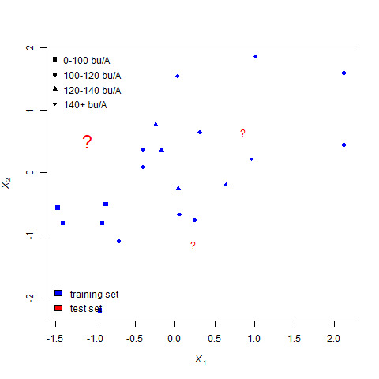

For that point, we measure the distance to every other point:


And identify the nearest 5 points (neighbors).  Of the five nearest neighbors, there is one square (yield up to 100 bushels), two circles (indicating yields between 100 and 120 bushels) and two triangles (yields between 120 and 140 bushels).  


There are two each circles and triangles, so R randomly selects from those two values.  The missing value is classified as a circle. 

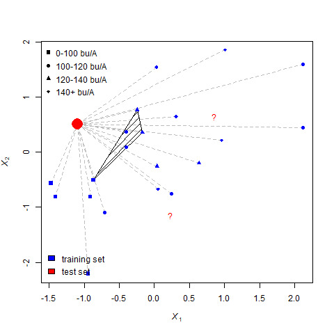

Let's repeat this process for the next missing value:


For this point, the five nearest neighbors are again identified.  


In this case there are three triangles and two circles, so the missing value is estimated to be a triangle.


For the last point, the nearest 5 neighbors include two circles, two triangles, and one diamond.


R randomly chooses between the triangle and circle -- again, the circle wins.


### Choosing $k$
In the example above, a value of 5 chosen arbitrarily to keep the illustation from becomming too muddled.  How should we choose $k$ in actual analyses?

Your first instinct might be to select a large $k$.  Why?  Because we have learned throughout this course that larger sample sizes reduce the influences of outliers on our predictions.  By choosing a larger k, we reduce the likelihood an extreme value (a bad neighbor?) will unduly skew our prediction.  We reduce the potential for bias.

The flip side of this is: the more neighbors we include, the less "near" they will be to the individual for which we are trying to make a prediction.  We reduce the influence of outlier, but at the same time predict a value that is closer to the population mean, rather than the true missing value.  In other words, a larger $k$ also reduces our precision.

A general rule of thumb is to choose a $k$ equal to the square root of the total number of individuals in the population.  We had 50 individuals in the population above, so we could have set our $k$ equal to 7.

### Model Cross-Validation
When we fit a kNN model, we should also cross-validate it.  In cross-validation, the data are portioned into two groups: a training group and a testing group.  The model is fit using the training group.  It is then used to make predictions for the testing group.  


The figures below illustrate a common cross-validation method, k-fold cross validation.  In this method, the data are divided into k number of groups.  In this example, k=10, meaning the data are divided into 10 groups.  Nine of the groups (in blue) is are combined to train the model.  The tenth group (in red) is the testing group, and used to validate the fit.  The validation process goes through 10 rounds.

In the first round, Groups 2 through 9 are used to train the model.  The fit of the model is then tested by how closely it can predict the observed values in Group 1.

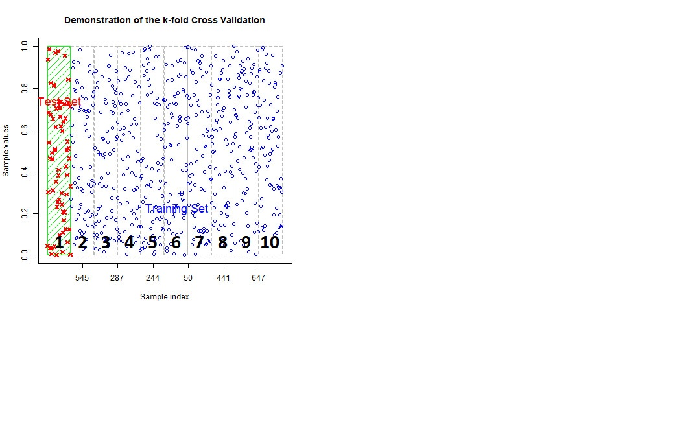

In the first round, Groups 1, 3, 4, 5, 6, 7, 8, 9, and 10 are used to train the model.  The fit of the model is then tested by how closely it can predict the observed values in Group 2.


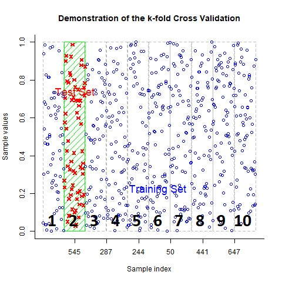

In the third round, Groups 1, 2, 4, 5, 6, 7, 8, 9, and 10 are used to train the model.  The fit of the model is then tested by how closely it can predict the observed values in Group 3.


This continues until each group has been used to train and test the model.

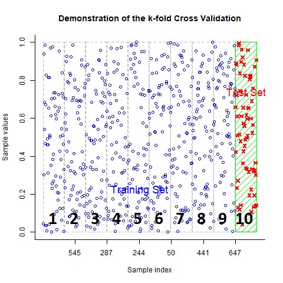

A linear regression of the predicted test values on the actual test values is then conducted and the regression coefficient, $R^2$, is calculated.  The Root Mean Square Error is also calculated during the regression.  You will recall the Root MSE is a measure of the standard deviation of the difference between the predicted and actual values.   

### Yield Prediction with Nearest Neighbor Analysis
As mentioned above, nearest neighbor analysis also works with qualitative data.  In this case, the values of the nearest neighbors are averaged for the variable of interest.  In R, there are various functions for running a nearest-neighbor analysis.  The output below was generated using the *caret* package, a very powerful tool which fits and cross-validates models at once.  


```r
library(caret)
ctrl = trainControl(method="repeatedcv", number=10, repeats = 1)

#knn
knnFit = train(corn ~ .,
                data = trainData,
                method = "knn",
                preProc = c("center", "scale"),
                trControl = ctrl)


knnFit
```

```
## k-Nearest Neighbors 
## 
## 665 samples
##   7 predictor
## 
## Pre-processing: centered (7), scaled (7) 
## Resampling: Cross-Validated (10 fold, repeated 1 times) 
## Summary of sample sizes: 599, 599, 598, 599, 597, 598, ... 
## Resampling results across tuning parameters:
## 
##   k  RMSE      Rsquared   MAE     
##   5  11.04766  0.8129430  7.996958
##   7  10.99521  0.8177150  8.001320
##   9  11.07555  0.8157225  8.147071
## 
## RMSE was used to select the optimal model using the smallest value.
## The final value used for the model was k = 7.
```

In the above output, the following are important:

* Resampling: this line tells us how the model was cross-validated (10-fold cross validation)
* Identification of the final value used for the model: Rememember when we discussed how to select the appropriate $k$ (number of neighbors)?  R compares multiple values of $k$.  In this case, it identifies $k$=7 as optimum for model performance.  
* Model statistics table.  Statistics for three levels of $k$ are given: 5, 7, and 9.  RMSE is the root means square error, Rsquared is $R^2$, the regression coefficient, and MAE is Mean Absolute Error (an alternative calculation of error that does not involve squaring the error).

Looking at the table results for k=7, we see the model had an $R^2$ of almost 0.81.  This is pretty impressive, given that were predicting mean county corn yield using relatively few measures of soil and environment.  The RMSE is about 11.1.  Using this with our Z-distribution, we can predict there is a 95% chance the actual corn yield will be within $1.96 \times11.1=21.8$ bushels of the predicted yield.

In this example, as you might have suspected, we did know the corn yield in the counties where it was "missing"; we just selected those counties at random and used them to show how k-nearest-neighbors worked.

So let's use the our nearest-neighbor model to predict the yields in those "missing" counties and compare them to the actual observed yields.  We can use a simple linear regression model for this, where:

$$ Predicted \ \ Yield = \alpha \ \ + \ \beta\ \cdot Actual \ \ Yield $$

Below, the predicted yields (y-axis) are regressed against the actual yields (x-axis).


```r
testData$corn_pred = predict(knnFit, testData)

testData %>%
  ggplot(aes(x=corn, y=corn_pred)) +
  geom_point() +
  geom_smooth(method = "lm") +
  labs(x="Actual Yield (bu)", y="Predicted Yield (bu)")
```

```
## `geom_smooth()` using formula 'y ~ x'
```

<!-- --> 

We can see the predicted and actual yields are strongly correlated, as evidenced by their linear distribution and proximity to the regression line.  The regression model statistics are shown below.

```r
library(broom)
```

```
## Warning: package 'broom' was built under R version 4.1.3
```

```r
model = lm(corn_pred~corn, data=testData)
glance(model) %>%
  dplyr::select(r.squared, sigma, p.value) %>%
  kableExtra::kbl()
```


\begin{tabular}[t]{r|r|r}
\hline
r.squared & sigma & p.value\\
\hline
0.785811 & 10.35285 & 0\\
\hline
\end{tabular}
Above are select statistics for our model.  We see the r.squared, about 0.83 is even better greater than in our cross-validation.  Sigma, the standard deviation, is smaller than in the validation, barely 9 bushels.  Finally, we see the significance of our model is very, very small, meaning the relationship between predicted and actual yield was very strong.  


```r
complete_dataset = testData %>%
  dplyr::select(-corn) %>%
  rename(corn=corn_pred) %>%
  rbind(trainPartition)
```

Finally, we can fill in the missing county yields in the map with which we started this section.  We see the predicted yields for the missing county seem to be in line with their surrounding counties; there are no islands of extremely high or extremely low yields.  You can see the yield of each county by clicking on it.


```r
pal_corn = colorBin("RdYlGn", bins=5, complete_dataset$corn)

m <- complete_dataset %>%
  leaflet() %>%
  addTiles() %>%
  addPolygons(
    fillColor = ~pal_corn(corn),
    fillOpacity = 0.8,
    weight=1,
    color = "black",
    popup = paste("yield:", as.character(round(complete_dataset$corn,1)))
  ) %>%
  addLegend(pal = pal_corn,
            values = ~corn)

#above code won't knit -- created static image for markdown
saveWidget(m, "temp.html", selfcontained = FALSE)
webshot("temp.html", cliprect = "viewport")
```

<!-- --> 


## Classification Trees
The last data science tool we will learn in this unit the classification tree.  The classification tree uses a "divide and conquer" or sorting approach to predict the value of a response variable, based on the levels of its predictor variables.

The best way to understand how a classification tree works is to play the game Plinko.  In Plinko, a player drops disc at the top of a table studded with pins.  

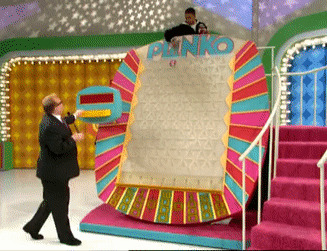

The disc falls down the table, bouncing to one side or the other of each successive pin.

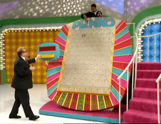

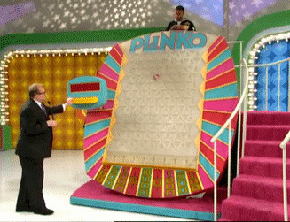

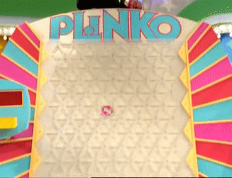

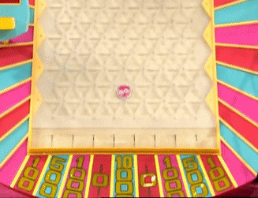

The bin determines what fabulous prize the player may have won.


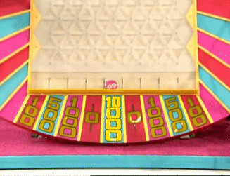  

Each level of the decision tree can be thought of as having pins.  Each pin is a division point along variable of interest.  If an observation has a value for that variable which is greater than the division point, it is classified one way and moves to the next pin.  If less, it moves the other way where it encounters a different pin.     

### Features
Classification trees are different from cluster and nearest neighbor analyses in that they identify the relative imporance of *features*.  Features include every predictor variable in the dataset.  The higher a feature occurs in a classification tree, the more important they are are in predicting the final value.  

Classification trees therefore shed a unique and valuable insight into the importance of variables, distinct from all other analyses we have learned. They provide insight into *feature importance*, not just their significance as a predictor.

### Quantitative (Categorical) Data
A classification tree predicts the category of the response variable.  We will start with yield categories, just as we did with the nearest neighbors section, because the results are intuitively easier to visualize and understand.

The classification process begins with the selection of a root.  This is the feature that, when split, is the best single predictor of the response variable.  The algorithm not only selects the root; it also determines where within the range (the threshold) of that feature to divide the populations.

What is the criterion for this threshold?  It is the value that divides the population into two groups in which the individuals within the group are as similar as possible.  

These results are displayed as a tree; thus, the "classification tree".  The results of our first split are shown below:


```r
library(party)
```

```
## Loading required package: grid
```

```
## Loading required package: mvtnorm
```

```
## Loading required package: modeltools
```

```
## Loading required package: stats4
```

```
## Loading required package: strucchange
```

```
## Loading required package: zoo
```

```
## 
## Attaching package: 'zoo'
```

```
## The following objects are masked from 'package:base':
## 
##     as.Date, as.Date.numeric
```

```
## Loading required package: sandwich
```

```
## 
## Attaching package: 'strucchange'
```

```
## The following object is masked from 'package:stringr':
## 
##     boundary
```

```r
x = trainData %>%
  dplyr::select(cum_gdd, silt, corn)

classes = cut(x$corn, breaks=c(-Inf, 100, 120, 140, Inf))
x = x %>%
  dplyr::select(-corn)

fit = ctree(classes ~., data=x,
            controls = ctree_control(maxdepth = 1))

plot(fit)
```

<!-- --> 

Cumulative growing degree days (cum_gdd) was selected as the root, and the threshold or split value was approximately 2198 GDD.  Counties where the cumulative GDD was less than this threshold tended to have yields in the lower two classes; above this threshold, counties tended to have yields in the greater two classes.

This particular algorithm also calculates a p-value that the distribution of the counts among the yield classes is different for the two groups.  We see the difference betwen the two groups (greater vs less than 2198 GDD) is highly significant, with a p-value < 0.001.

Next, let's add another level to our tree.  The two subgroups will each be split into two new subgroups.


```r
fit = ctree(classes ~., data=x,
            controls = ctree_control(maxdepth = 2))

plot(fit)
```

<!-- --> 

Our tree now has three parts.  The root was discussed before.  At the bottom of the tree, we have four nodes: Node 3, Node 4, Node 6, and Node 7.  These represent the final groupings of our data.

In the middle, we have two branches, labelled as branches 2 and 5 of our tree.  Each branch is indicated by an oval.  The branch number is in a box at the top of the oval.  

Counties that had cum_gdd < 2198 were divided at branch 2 by cum_gdd, this time into counties with less than 1881 cum_gdd and counties with more than 1881 cum_gdd.  Almost all counties with less than 1881 cum_gdd had yields in the lowest class.  Above 1881 cum_gdd, most yields were still in the lowest class, but some were in the second lowest class.

Counties with greater than 2198 cum_gdd were divided at branch 5 by soil percent silt.  Counties with soils that with less than 28.2 percent slit had yields that were mostly in the middle two yield classes.  Above 28.2 percent silt, most yields were in the upper two classes.

The beauty of the regression tree is we are left with a distinct set of rules for predicting the outcome of our response variable.  This lends itself nicely to explaining our proeduction.  Why do we predict a county yield will be in one of the two highest classes?  Because the county has cumulative GDDs greater than 2198 and a soil that has a percent silt greater than 28.2

The algorithm will continue to add depths to the tree until the nodes are as homogeneous as possible.  The tree, however, will then become too complex to visualize.  Below we have three levels to our tree -- we can see how difficult it is to read.


```r
fit = ctree(classes ~., data=x,
            controls = ctree_control(maxdepth = 3))

plot(fit)
```

<!-- --> 


### Quanatitiative (Continuous) Data
The same process above can be used with quantitative data -- in this example, the actual yields.  When we use yield, the root of our tree is not cumulative growing degree days, but total precipitation. Instead of a bar plot showing us the number of individuals in each class, we get a boxplot showing the distribution of the observations in each node.  When we work with quantitative data, R identifies the feature and split that minimizes the variance in each node.  


```r
fit = ctree(corn ~., data=trainData,
            controls = ctree_control(maxdepth = 1))
plot(fit)
```

<!-- --> 

When we add a second level to our tree, we see that observations where precipitation was less than or equal to about 446.5 mm/season, the data was next split by cum_gdd.  Counties with a cum_gdd les than about 2198 had lower yields than counties with a cum_gdd > 2198.  

Where ppt was greater than 446 mm per season, individuals were next split by water holding capacity (whc).  Counties where whc was greater than about 28.8 cm/cm soil had greater yield than counties with less water holding capacity.


```r
fit <- ctree(corn ~ ., data=trainData,
             controls = ctree_control(maxdepth = 2))
plot(fit)
```

<!-- --> 

Like before, we can continue adding branches, although our virtual interpretation of the data will become more challenging.

### Overfitting
In nearest-neighbors analysis, we learned the size of k (the number of neighbors) was a tradeoff: too few neighbors, and the risk of an outlier skewing the prediction increased.  Too many neighbors, and the model prediction approached the mean of the entire population.  The secret was to solve for the optimum value of k.

There is a similar tradeoff with classification trees.  We can continue adding layers to our decision tree until only one observation is left in each node.  At that point, we will perfectly predict each individual in the population.  Sounds great, huh?

Yeah, but what about when you use the classification model (with its exact set of rules for the training population) on a new population?  It is likely the new population will follow the more general rules, defined by the population splits closer to the root of the tree.  It is less likely the population will follow the specific rules that define the nodes and the branches immediately above.

Just as a bush around your house can become messing and overgrown, so can a classification tree become so branched it loses its value.  The solution in each case is to prune, so that the bush regains its shape, and the classification tree approaches a useful combination of general application and accurate predictions.

### Cross Validation
Just as with nearest-neighbors, the answer to overfitting classification trees is cross-validation.  Using the same cross-validation technique (10-fold cross-validation) we used above, let's fit our classification tree.


```r
library(caret)
ctrl = trainControl(method="repeatedcv", number=10, repeats = 1)

#knn
partyFit = train(corn ~ .,
                data = trainData,
                method = "ctree",
                trControl = ctrl)

partyFit
```

```
## Conditional Inference Tree 
## 
## 665 samples
##   7 predictor
## 
## No pre-processing
## Resampling: Cross-Validated (10 fold, repeated 1 times) 
## Summary of sample sizes: 598, 599, 599, 599, 598, 598, ... 
## Resampling results across tuning parameters:
## 
##   mincriterion  RMSE      Rsquared   MAE      
##   0.01          13.05396  0.7412480   9.689862
##   0.50          13.20743  0.7342159   9.974611
##   0.99          15.13028  0.6567629  11.933852
## 
## RMSE was used to select the optimal model using the smallest value.
## The final value used for the model was mincriterion = 0.01.
```

The output looks very similar to that for nearest neighbor, except instead of $k$ we see a statistic called mincriterion.  The mincriterion specifies the maxiumum p-value for any branch to be included in the final model.

As we discussed above, the ability of the classification tree to fit new data decreases as the number of branches and nodes increases.  At the same time, we want to include enough branches in the model so that we are accurate in our classifications.

In the output above, the mincriterion was 0.01, meaning the p-value must be no greater than 0.01.  This gave us an Rsquared of about 0.745 and and Root MSE of about 13.0.

As with the $k$-Nearest-Neighbors analysis, we can compare the predicted yields for the counties dropped from our model to their actual values.


```r
testData$corn_pred = predict(partyFit, testData)

testData %>%
  ggplot(aes(x=corn, y=corn_pred)) +
  geom_point() +
  geom_smooth(method = "lm") +
  labs(x="Actual Yield (bu)", y="Predicted Yield (bu)")
```

```
## `geom_smooth()` using formula 'y ~ x'
```

<!-- --> 


```r
library(broom)
model = lm(corn_pred~corn, data=testData)
glance(model) %>%
  dplyr::select(r.squared, sigma, p.value) 
```

```
## # A tibble: 1 x 3
##   r.squared sigma  p.value
##       <dbl> <dbl>    <dbl>
## 1     0.720  12.0 1.39e-46
```

We see the model strongly predicts yield, but not as strongly as $k$-Nearest Neighbors.

### Random Forest
There is one last problem with our classification tree.  What if the feature selected as the root of our model is the best for the dataset to which we will apply the trained model?  In that case, our model may not be accurate.  In addition, once a feature is chosen as the root of a classification model, the features and splits in the remainder of the model also become constrained.

This not only limits model performance, but also gives us an incomplete sense of how each feature truly effected the response variable.  What if we started with a different root feature?  What kind of model would we get?

This question can be answered with an *ensemble* of classification trees.  This ensemble is known as a *random forest* (i.e. a collection of many, many classification trees).  The random forest generates hundreds of models, each starting with a randomly selected feature as the root.  These models are then combined as an ensemble to make predictions for the new population.


```r
rfFit = train(corn ~ .,
                data = trainData,
                method = "rf",
                trControl = ctrl)

rfFit
```

```
## Random Forest 
## 
## 665 samples
##   7 predictor
## 
## No pre-processing
## Resampling: Cross-Validated (10 fold, repeated 1 times) 
## Summary of sample sizes: 598, 600, 600, 601, 599, 597, ... 
## Resampling results across tuning parameters:
## 
##   mtry  RMSE       Rsquared   MAE     
##   2     10.559385  0.8360096  7.868132
##   4      9.983132  0.8482014  7.327396
##   7      9.788704  0.8519592  7.159581
## 
## RMSE was used to select the optimal model using the smallest value.
## The final value used for the model was mtry = 7.
```

If we compare our model results to the individual classification tree above, and to the performance of our nearest-neighbor model, we see the random forest provides a better fit of the data.


```r
testData$corn_pred = predict(rfFit, testData)

testData %>%
  ggplot(aes(x=corn, y=corn_pred)) +
  geom_point() +
  geom_smooth(method = "lm") +
  labs(x="Actual Yield (bu)", y="Predicted Yield (bu)")
```

```
## `geom_smooth()` using formula 'y ~ x'
```

<!-- --> 


```r
library(broom)
model = lm(corn_pred~corn, data=testData)
glance(model) %>%
  dplyr::select(r.squared, sigma, p.value) 
```

```
## # A tibble: 1 x 3
##   r.squared sigma  p.value
##       <dbl> <dbl>    <dbl>
## 1     0.810  9.51 3.09e-60
```


### Feature Importance
When we use random forest analysis, there is no one tree to review -- the forest, after all, is a collection of many hundreds or thousands of trees.  There is also no longer one set of rules to explain the predicted values, since all trees were used to predict corn yield.

Random forest analysis, however, allows us to rank the features by importance.  Feature importance is calculated from the number of times a feature occurs in the top branches of tree and the most frequent level at which a feature first occurs in the model.  

We see in the barplot below the feature importance in our random forest model.  Precipitaion was by far the single most important feature in predicting yield.  The next most important feature, as we might expect, was cumulative growing degree days.  

```r
library(vip)
```

```
## 
## Attaching package: 'vip'
```

```
## The following object is masked from 'package:utils':
## 
##     vi
```

```r
vip(rfFit)
```

<!-- --> 

After that, we might wonder whether soil biology or texture might be the next most important feature.  Our feature importance ranking suggests that organic matter is slightly more important than clay, followed by water holding capacity.  We might infer that soil fertility which increases with organic matter and clay, was more important than drainage, which would be predicted by water holding capacity and our last variable, sand.


## Summary
With that, you have been introduced to three (four, if we include random forest) powerful machine learning tools.  I don't expect that you will personally use these tools on a regular basis; thus, this lesson is not hands-on like other lessons.  It is most important that you are aware there is a whole world of statistics beyond what we have learned this semester, beyond designed experiments and the testing of treatments one-plot-at-a-time.  

This is not to disparage or minimize the statistics we learned earlier in this course.  Controlled, designed-experiments will always be key in testing new practices or products.  They will be how products are screened in the greenhouse, in the test plot, in the side-by-side trial on-farm.  They are critical.

But for big, messy problems, like predicting yield (or product performance) county-by-county, machine learning tools are very cool.  They are behind the hybrid recommended for your farm, the nitrogen rate recommended for your sidedress.  They are way cool and offer wicked insights and I believe it is worth your while -- as agriculutral scientists -- to be aware of them.
